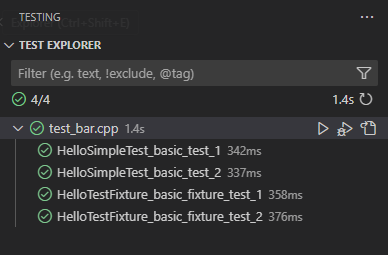

# VSC Bazel Tools

This extension adds some utility to ease the work with C/C++ targets in a bazel workspace and allows to work efficiently with IntelliSense.

## Features

- Generates a `compile_commands.json` for an existing bazel workspace via command, based on the [bazel-compile-commands-extractor](https://github.com/hedronvision/bazel-compile-commands-extractor) tool.
- Run or debug `cc_test` targets via the vscode testing API, using the [Test Explorer UI extension](https://marketplace.visualstudio.com/items?itemName=hbenl.vscode-test-explorer). 

Note: Currently only googletest is supported as testing framework.

## Requirements

- The `bazel` command needs to be known from command line, so make sure bazel is properly installed.
- Your bazel project needs to depend on hedronvision's [bazel-compile-commands-extractor](https://github.com/hedronvision/bazel-compile-commands-extractor), as this tool is currently used to generate the compile commands.
- If you want to use the testing feature, the [Test Explorer UI extension](https://marketplace.visualstudio.com/items?itemName=hbenl needs to be installed.

## Usage

### Compile commands

Having a file from your bazel workspace opened, just enter `vsc-bazel-tools` from the command palette (`Strg+Shift+P`). 
Via `Generate compile commands` the `compile_commands.json` file will be generated. 

In large repositories you might want to limit the number of targets to generate compile commands for with 
a custom `refresh_compile_commands` bazel target (see [bazel-compile-commands-extractor](https://github.com/hedronvision/bazel-compile-commands-extractor) for details). You can reference this via the `customCompileCommandsTarget` setting.

### Run & debug tests

If the `activateTesting` setting is set to true (default), the extension tries to discover `cc_test` targets and parses underlying test cases. Just open the test explorer UI and you should find a list of your current tests, similar to this:

Depending on the size of your C++ project, the test discovery process might take a while. You can reduce the search space by the extension setting `testDiscoverLabel`. In case of unexpected failures, check the extension output for error logs.

## Extension Settings

* `vsc-bazel-tools.customCompileCommandsTarget`: Specifies a custom bazel target (label) to generate the compile commands.
* `vsc-bazel-tools.activateTesting`: Discover and publish tests via test explorer UI.
* `vsc-bazel-tools.testDiscoverLabel`: Bazel label for test discovery (e.g. `//my/package/...`).
